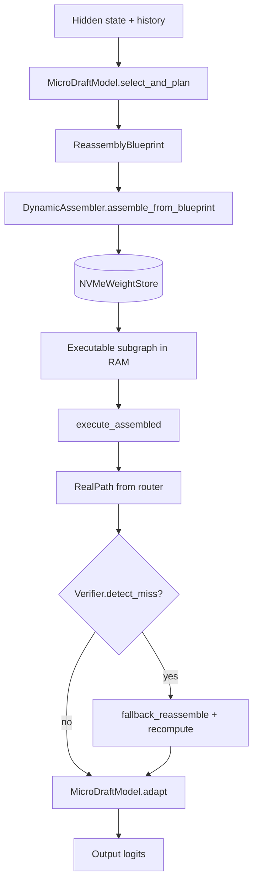

# Speculative Weight Streaming (SWS)


**Streaming a Giant Into a Small Room: Dynamic Model Recomposition for Massive MoE LLMs in 32 GB RAM**

SWS is a system for running frontier-scale Mixture-of-Experts models whose full weight footprint vastly exceeds available RAM — think 700B-parameter giants such as GLM 5.2 on a 32 GB machine. The giant is never loaded whole. A permanently-resident **micro draft model** selects individual weight shards from NVMe, and a **dynamic assembler** reorganizes them into a compact, fully executable sub-model that lives in RAM for one forward pass at a time.

## Conceptual framing

### The problem with "fit the model in memory"

Traditional inference assumes RAM is a fixed container the model must fit into. For MoE models at frontier scale, that assumption is the bottleneck: the full parameter count is enormous, but **activation sparsity** means only a tiny fraction of experts and layers participate in any given token.

SWS reframes RAM as a **prediction-driven assembly floor**, not a warehouse. The full model lives on fast storage as disaggregated **raw clay** — individual experts, attention blocks, routers — and only the pieces needed for the *next* computation are sculpted into a working instance.

### Speculative decoding, lifted into the weight domain

Token-level speculative decoding runs: draft → verify → fallback. SWS runs the same loop one level down:

| Token speculative decoding | SWS (weight domain) |
|---|---|
| Draft model proposes tokens | Micro draft model proposes a **reassembly blueprint** |
| Target model verifies tokens | Verifier checks blueprint against **real router path** |
| Reject → re-decode | Miss → **fallback reassemble** with exact pieces + recompute |

Correctness is preserved at the **output boundary** (logits / tokens), not at every intermediate weight. Approximate stand-ins may participate in the draft assembly; the verifier ensures they never silently corrupt the final result.

### The micro draft model as sculptor

The micro draft model is not a smaller copy of the giant. It is a **selection and planning network** — hundreds of MB, always resident — that answers: *given this hidden state and token history, which raw pieces should compose the next executable subgraph?*

It learns to run **one step ahead of the router**: anticipating top-k expert selection before the real gating network fires, so pieces can be prefetched from NVMe while prior-layer compute runs.

## Core principle

> The giant model is never instantiated in RAM. A micro draft model selects the raw clay, reorganizes it into a temporary executable instance, and a strict verifier keeps that assembly honest.

**Governing inequality** — the system is profitable only when:

```
(selection_accuracy × bandwidth_saved) > (miss_rate × (recompute_cost + fetch_penalty))
```

A **weight miss** is far more expensive than a token rejection in speculative decoding: NVMe→RAM bandwidth is orders of magnitude below RAM→compute bandwidth. The micro draft model must forecast with high precision; the verifier exists precisely because misses are costly.

## Architecture

Four cooperating modules, each independently testable:

### 1. NVMeWeightStore — repository of raw clay

The full giant lives on disk as fine-grained `safetensors` shards:

| Shard type | Example ID | Contents |
|---|---|---|
| Expert FFN | `layer_3/expert_7` | `gate_proj`, `up_proj`, `down_proj` weights |
| Attention | `layer_3/attention` | Q/K/V/O projections |
| Router | `layer_3/router` | gating linear |
| Global | `embed_weight`, `lm_head_weight` | embedding, output head |

Key operations:
- `fetch(shard_id)` — async exact retrieval (thread pool; overlaps with compute)
- `extract_pieces(selection)` — batch extraction for reassembly
- `reconstruct_approx(shard_id)` — offline int8 stand-in for low-priority pieces
- Lazy `safetensors` mmap — no full-model materialization at any point, including init

### 2. MicroDraftModel — intelligent selector and planner

Given `(hidden_state, token_history)`, emits a `ReassemblyBlueprint`:

```python
ReassemblyBlueprint(
    layers=[LayerBlueprint(layer_idx, expert_probs, selected_experts), ...],
    high_priority_pieces={...},   # exact fetch + immediate assembly (confidence ≥ τ)
    low_priority_pieces={...},    # approximated or deferred stand-ins
)
```

- **τ** (`confidence_threshold`) splits exact vs approximate materialization
- Infrastructure shards (embed, norm, attention, router per layer) are always high-priority
- `adapt(blueprint, real_path)` — online BCE training on `(forecast, router top-k)` pairs
- `train_offline(traces)` — warm-start from Phase 1 logged traces before deployment

### 3. DynamicAssembler + PredictiveCache — reassembly engine

Materializes the blueprint into an `AssembledSubgraph` — a coherent executable instance backed by resident weight pieces in RAM:

```
assemble_from_blueprint(blueprint, store)  →  AssembledSubgraph
execute_assembled(input_ids)               →  (logits, RealPath)
fallback_reassemble(miss, blueprint, store) →  expanded exact subgraph
```

**PredictiveCache** enforces the byte budget (default 32 GB):
- Prediction-driven eviction: evict pieces with lowest blueprint-assigned future utility, not LRU blindly
- Infrastructure pinning: lower-layer attention, norms, routers stay resident across steps
- `trim_to_budget()` after each step; `assert_within_budget()` in tests

Execution uses `LazyMoERunner` — expert `nn.Linear` modules are proxies that pull from cache on `forward()`, so the subgraph is truly assembled from fetched pieces rather than a monolithic `state_dict` load.

### 4. Verifier + reassembly loop

After each forward pass, the verifier compares the assembled subgraph against the **real activation path** captured from router hooks:

```python
miss = needed_shards(real_path) - resident_set
miss |= {sid for sid in needed if cache[sid].is_exact == False}  # reject approx stand-ins
```

- **Accept** (miss empty): zero stall, proceed to next token
- **Reject**: `fallback_reassemble` fetches exact pieces, rebuilds subgraph, recomputes layer strictly
- Output equivalence to the fully-loaded reference model: `max_abs(logit_diff) < 1e-4` (enforced in gates)

### End-to-end loop



## Phased build plan and gates

Development proceeds in strict phases; each gate must pass before the next begins.

| Phase | Capability | Gate criterion |
|---|---|---|
| **0** | Sharding + lazy NVMe store | RSS stays low; single forward `logit_diff < 1e-4` vs vanilla |
| **1** | PredictiveCache + on-demand LRU | Full generation token-exact; peak RAM ≤ budget |
| **2** | MicroDraftModel + async prefetch | Stall count drops vs baseline; outputs still exact |
| **3** | Approximation path + verifier fallback | Logit diff `< 1e-4`; verifier catches every inexact piece |
| **4** | Online adaptation + prediction eviction | Miss rate decreases over long run; throughput beats Phase 1 |

```bash
python benchmarks/run_all_gates.py   # run all five gates
python -m pytest tests/ -q           # unit tests
```

Reported metrics per gate: peak RSS, peak cache bytes, miss rate, accept/reject rate, stalls, tokens/sec, output fidelity vs vanilla.

## Why MoE — and why not dense models

MoE models (Mixtral, Qwen MoE, GLM 5.2) activate **k ≪ E** experts per token out of **E** total per layer. The micro draft model exploits router predictability: if it can forecast the active expert set one step ahead, the reassembled subgraph touches ~`k × L` expert shards instead of `E × L`.

On a **dense** model, every parameter fires every step. There is no sparsity to select against — SWS collapses to on-demand loading with verifier overhead and wins nothing. This is an honest structural limitation, not an implementation gap.

## Getting started

### Prerequisites

- Python 3.10+
- PyTorch, Hugging Face `transformers`, `safetensors`, `psutil`

```bash
pip install -r requirements.txt
```

### Quick API example

```python
from pathlib import Path
from sws import SpeculativeWeightStreamer, NVMeWeightStore
from sws.sharding import shard_model_state_dict
from sws.synthetic_moe import init_deterministic_model

model = init_deterministic_model()
shard_dir = Path("shards/")
shard_model_state_dict(model.state_dict_named(), shard_dir)

store = NVMeWeightStore(shard_dir)
streamer = SpeculativeWeightStreamer(
    model.cfg, store,
    ram_budget_mb=8_000,
    use_micro_draft=True,
    confidence_threshold=0.15,
)

import torch
prompt = torch.tensor([[1, 5, 12]])
output_ids = streamer.generate(prompt, max_new_tokens=16)
print(streamer.aggregate_metrics)
```

### Package layout

```
sws/
  store.py          # NVMeWeightStore — raw clay repository
  micro_draft.py    # MicroDraftModel — selector + blueprint planner
  assembler.py      # DynamicAssembler — subgraph materialization + execution
  cache.py          # PredictiveCache — byte-budget enforcer
  verifier.py       # Verifier — detect_miss, equivalence guarantee
  streamer.py       # SpeculativeWeightStreamer — main loop
  lazy_model.py     # LazyMoERunner — weight proxies for assembled subgraph
  sharding.py       # Per-expert safetensors partitioning + int8 approx shards
  hf_integration.py # Real HF MoE sharding + LazyLinear proxies
  synthetic_moe.py  # Tiny MoE for local gates without multi-GB downloads
benchmarks/         # Phase 0–4 gate scripts
tests/              # Unit tests
```

### Real MoE validation (beyond synthetic gates)

```python
from sws.hf_integration import shard_hf_model, recommended_test_models

# Smallest genuine MoE with per-expert weight exposure
shard_hf_model(recommended_test_models()[0], output_dir="shards/")
```

Recommended models (smallest first):
- `trl-internal-testing/tiny-Mixtral-8x7B-Instruct-v0.1` — CI / smoke tests
- `Qwen/Qwen1.5-MoE-A2.7B`
- `mistralai/Mixtral-8x7B-v0.1`

## Limitations and operational caveats

- **Sparse MoE only** — dense architectures see no benefit
- **NVMe bandwidth floor** — practical throughput requires fast SSD; HDD will stall on misses
- **Warm-up period** — micro draft model needs offline traces or online adaptation before peak selection accuracy
- **Verifier cost** — reject/reassemble paths are correct but slow; minimizing miss rate is the primary engineering goal
- **700B scale** — this repo is a proof-of-concept with synthetic and small real MoE gates; production deployment requires CUDA stream prefetch, multi-GPU shard placement, and router distillation at scale

## Roadmap

- CUDA stream prefetch overlapping attention compute
- vLLM / llama.cpp integration
- Router distillation for micro draft model (train selector directly on giant router logits)
- int4/int2 reconstruction with quality-aware verifier tolerance
- Distributed multi-GPU shard placement and cross-rank reassembly

## Contributing

Contributions welcome — especially micro draft model accuracy, verifier latency reduction, and new MoE family support.

## References

- Speculative decoding (Leviathan et al.; Chen et al.)
- Mixture-of-Experts routing dynamics
- Predictive caching and working-set management

---